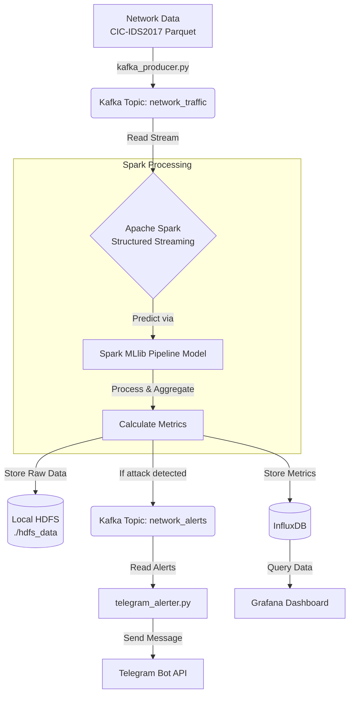

# Real-Time Network Monitoring & Incident Detection Pipeline

## Demo & Deliverables
*   **Demo Video**: [Watch E2E System Demo Video on Google Drive](https://drive.google.com/file/d/1TqQe7CIiEVBauEuLulRYxk8pxjPPVIJA/view)
*   **Project Report**: `report.pdf` (LaTeX Source: [report.tex](file:///f:/Tin/code/UETTTTTTTTTTTTTTTTTTTTTTT/Big%20Data/Network-Monitoring/report.tex))
*   **Presentation Slides**: `slide.pdf`

## Architecture Overview
This project implements a big data pipeline to monitor network traffic in real-time, detecting cyber attacks using the **CIC-IDS2017** dataset and a native PySpark MLlib Random Forest model.

## Dataset
- **Full CIC-IDS2017**: [https://www.unb.ca/cic/datasets/ids-2017.html](https://www.unb.ca/cic/datasets/ids-2017.html)
  - *Note: For demo purposes, we have included only the `data/parquet/DoS-Wednesday-WorkingHours.pcap_ISCX.parquet` file so you can test the pipeline out-of-the-box with DoS attacks.*
  - *To run a full simulation with all attack types, download the raw `.csv` files from the link above, run the preprocessing notebooks, and place the resulting files in your data directories.*

## Data Processing Flow


### Key Components & Files:
1. **Producer (`kafka_producer.py`)**: Reads data from Parquet files (CIC-IDS2017) and pushes it to Kafka with a 50ms delay simulation to model real-time network traffic.
2. **Streaming Processor (`spark_streaming.py`)**: Consumes data from Kafka and applies the native PySpark MLlib `PipelineModel` (`spark_rf_model`) directly in the JVM for real-time predictions.
3. **Storage & Metrics**: 
   - Raw processed data is saved to a Local HDFS directory (`./hdfs_data/processed_traffic`).
   - Aggregated metrics are written to InfluxDB.
   - If an attack is detected, the metrics are pushed to the `network_alerts` Kafka topic.
4. **Alerting (`telegram_alerter.py`)**: Listens to the `network_alerts` topic and automatically sends real-time alert notifications via Telegram.
5. **Visualization**: **Grafana** pulls data from InfluxDB to display a visual dashboard for monitoring network health.
6. **Helper Utilities**:
   - `smoke_test_model.py`: Test script to verify that the Spark model loads cleanly without filesystem class conflicts.
   - `delete_crc.py`: Utility to clean up `.crc` checksum files inside the saved model folder to prevent line-ending checksum mismatches on Windows/WSL.

## Technology Stack

- **Language**: Python
- **Message Broker**: Apache Kafka, Zookeeper
- **Stream Processing**: Apache Spark (Structured Streaming, PySpark)
- **Machine Learning**: Spark MLlib (Random Forest)
- **Data Storage**: 
  - Hadoop/HDFS (Simulated locally)
  - InfluxDB (Time-series Database)
- **Visualization**: Grafana
- **Alerting**: Telegram Bot API
- **Deployment**: Docker Compose

---

## How to run (Setup & Demo)

### Step 1: Prerequisites
- Install Docker and Docker Compose.
- Install Java 17 (Required to run Apache Spark).
- Install Python 3.8+.

Installing Java 17 (Ubuntu/Linux):
```bash
sudo apt-get update && sudo apt-get install -y openjdk-17-jdk
export JAVA_HOME=/usr/lib/jvm/java-17-openjdk-amd64
export PATH=$JAVA_HOME/bin:$PATH
```

### Step 2: Start the Infrastructure
Launch Zookeeper, Kafka, InfluxDB, and Grafana using Docker Compose:
```bash
docker-compose up -d
```

### Step 3: Configure the Python Environment
Create a virtual environment and install the required libraries:
```bash
# Create virtual environment
python -m venv venv

# Activate (Linux/macOS)
source venv/bin/activate

# Install dependencies
pip install -r requirements.txt
```

### Step 4: Configure the Telegram Bot
To receive alerts via Telegram, create a `.env` file in the root directory (alongside `telegram_alerter.py`) with the following content:
```env
TELEGRAM_BOT_TOKEN=your_telegram_bot_token_here
TELEGRAM_CHAT_ID=your_telegram_chat_id_here
```

### Step 5: Run the Pipeline Components (Open 3 separate terminals)

**Terminal 1: Start Spark Streaming**
This is the core of the system. Run the command and wait until you see `Starting streaming query`.
```bash
python spark_streaming.py
```

**Terminal 2: Start Telegram Alerter**
Listens for and sends alerts when an attack is detected.
```bash
python telegram_alerter.py
```

**Terminal 3: Start Kafka Producer**
Starts pushing network traffic data into Kafka.
```bash
python kafka_producer.py
```

### Step 6: View the Dashboard on Grafana
1. Open your browser and go to [http://localhost:3000](http://localhost:3000)
2. Login with credentials: `admin` / `admin`.
3. Navigate to **Dashboards** to view the pre-configured Network Monitoring dashboard (Data source and dashboard are automatically provisioned).
